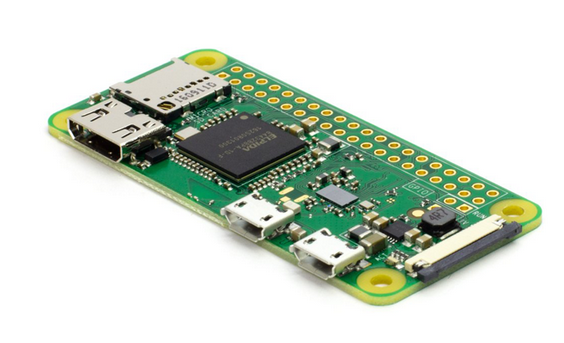
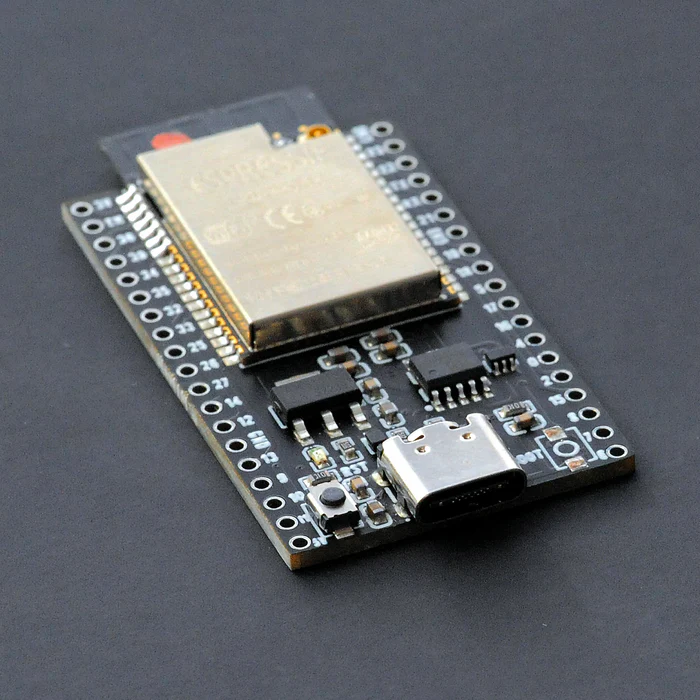

# MRPMG-Docklands

A repository of sample projects for Raspberry Pi and ESP32 to be used at our meetups

## Introduction

In the coming sessions we will encourage our members to extend their knowledge by sharing and experiencing new aspects of all things microcontroller and computer.

We will start with some 'simple' projects to get used to working on a new platform/environment.

Please feel free to clone this and fork it for your own purposes.

## Platforms

Raspberry Pi Zero W V1 (RPi)

[RPi Zero Version 1.3](https://www.raspberrypi.com/products/raspberry-pi-zero-w/)

ESP32-WROVER

[ESP32-WROVER from Lonely Binary](https://lonelybinary.com/collections/esp32/products/lonely-binary-esp32-wrover-the-king-of-esp32)

## Projects

For each of the following projects the details for the specific Platform are different.  You will find the details in the [RPi folder](RPi) or the [ESP folder](ESP)

### 1. Getting Connected

In this project we go from getting a bare board as delivered from a supplier to having the board up and running connected to your PC where you can create programs and load them on to your chosen platform.
We will provide some links to support, tutorials, descriptions of the platform capabilities.

**IDE's** - Integrated Development Environments
You will have to choose between cloud based development environment, PC based environments or physically loaded platform based.

**Languages**
A variety of programming languages are supported on the devices.  What are you familiar with?

**Physical connection**
USB is common but are you connecting to Windows, Mac or Linux
Do you have the correct driver?

### 2. Seeing it starting to do stuff

You will find that both platforms have different use cases with advantages and disadvntages but we will get to understand how they are best used together.

### 3. Lets have a chat

Communicating between platforms is a common feature which builds comprehensive solutions.  The comms may happen over serial, LAN, WiFI, Bluetooh etc.
